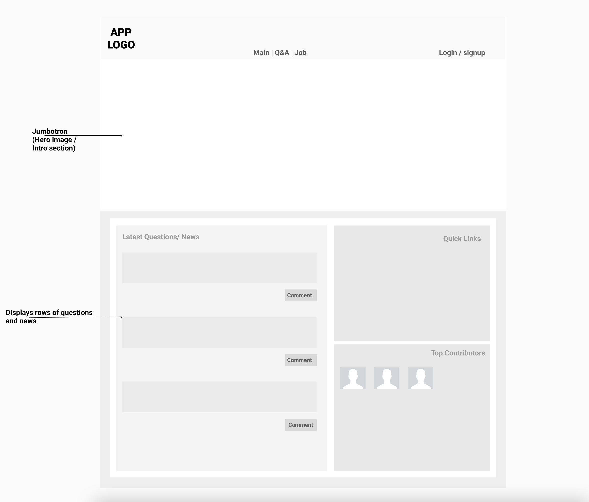
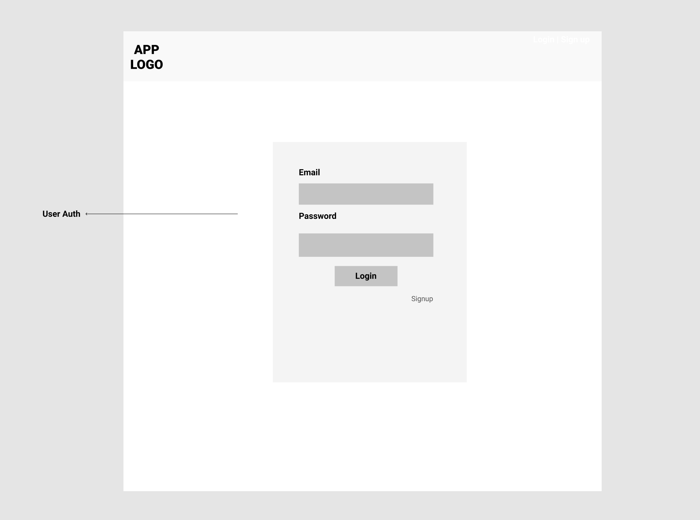
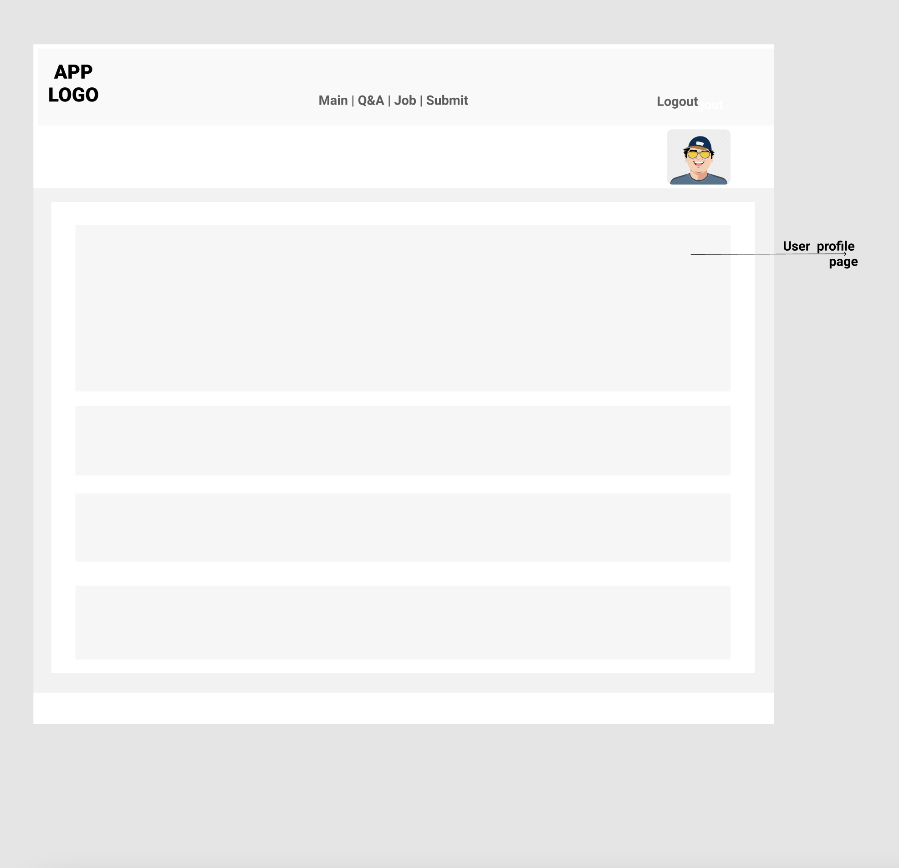
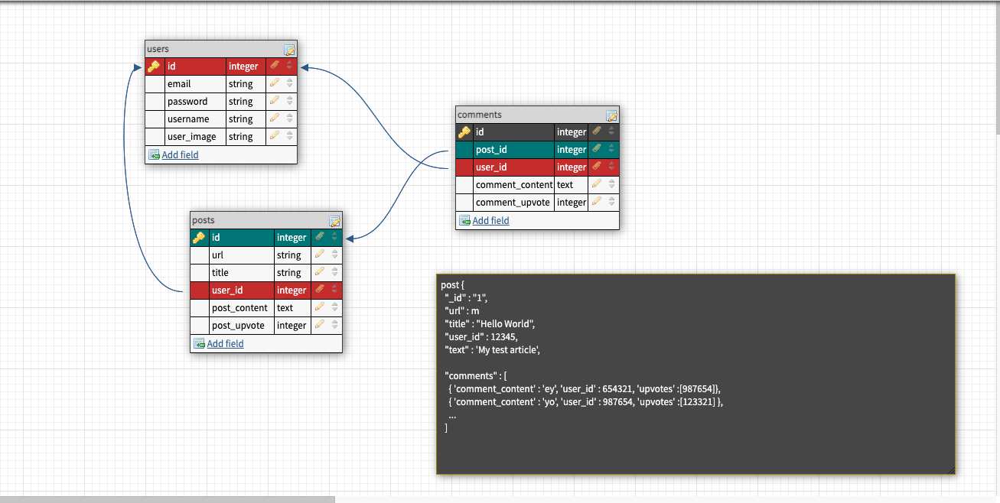
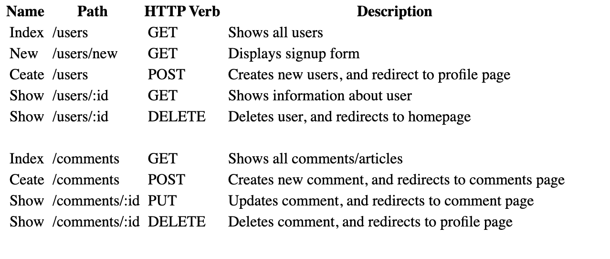

<h1 align="center"><b>CodeNews 🖥 🗞</b></h1>

#### Project Board: 
[Trello](https://trello.com/b/w0GiYk44/codenews-project-board)

# **Description**
Codenews is a social news platform focusing on computer science, software-engineering, and education. Users can post links to relevant information and articles and then discuss these topics. This allows users to stay up-to-date on current industry trends and news. Users also have access to a Q&A forum where they may post technical questions and gain feedback from other users.

# **User Stories:**
# **Minimum Viable Product**
- The CodeNews homepage will display user content along with a navbar that features options for registering an account, submitting a post, and features for the main page and Q&A section.

#### ***As a general user***
- you should be able to view the home page and see all recent posts.
- you should be able to register an account or log into your own account
- you should be able to be to select an individual post and then be redirected to the link's webpage
- you should also be able to click on the comments section and view the discussion
- you should also be able to view the Q&A forum

#### ***As a logged-in user***
- you should be redirected to your profile page after signing in
- your username should be displayed on every page
- your navbar should contain a 'submit' option
- you should be able to click the submit option to make a post
- you should be able to reply to comments in forums
- you should be able to upvote a post or comment

# **Stretch Goals**
- users can edit and delete posts/comments
- users can add profile pictures, location information, and an about me section
- users can view profiles and message eachother directly
- downvotes
- users can view and search job postings based on the following API [The Muse](https://www.themuse.com/developers/api/v2?ref=apilist.fun)

# **Group Roles**
Chris: Frontend Developer
Ian & Sunil: Backend Devlopers
Josh: Backend/Front Support & Git Manager

# **Technologies Used**
- [ReactJS Framework](https://reactjs.org/) - Frontend Implementation, Components, DOM Manipulation
- [Bootstrap](https://getbootstrap.com/) - Frontend Design and styling
- [Node.JS](https://nodejs.org/en/) - Runtime Server Environment, packages
- [Express](https://expressjs.com/) - Server, Handling Requests
- [MongoDB](https://www.mongodb.com/) - NoSQL Database, Will store user generated data 
- [Mongoose]() - Database ORM, Will handa data relationships and schemas
- [Bcrypt](https://www.npmjs.com/package/bcrypt) - Password hasher
- [JSON Webtoken](https://www.npmjs.com/package/jsonwebtoken) - Certify user identity

## **API(S)**
- [The Muse Jobs Api](https://www.themuse.com/developers/api/v2?ref=apilist.fun) - free API for job searching and posting

# **Wireframes**
#### ***Homepage***

#### ***Login Page***

#### ***User's Profile***

# **ERD**

# Routes 
### **Users**

# **Sprints**
Monday:
* Standup
* Quick meeting and finalization
* Create needed folders and files for first steps
* Setup tech and install packages
* Stub components
* Stub roues

Tuesday:
* Standup 

Wednesday:
* Standup 

Thursday:
* Standup 

Friday:
* Standup 

Saturday:
* Standup 

Sunday:
* Standup 